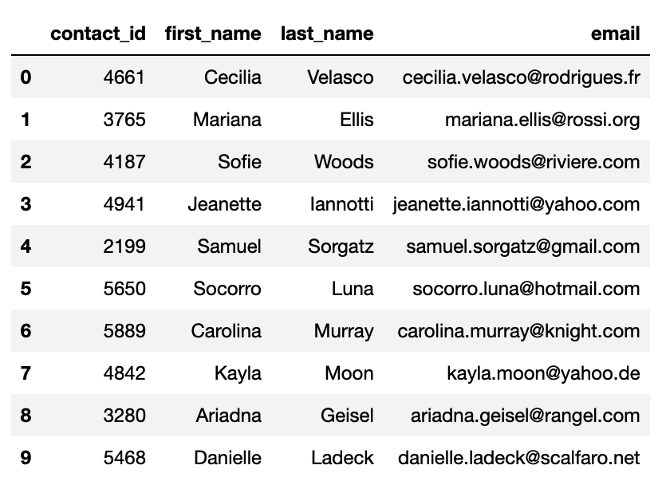

# Class Project 2 - Crowdfunding_ETL

#### **Table of Contents:**
* [Prep Work](#prep-work)
* [Instructions](#instructions)
* [Create the Category and Subcategory DataFrames](#create-the-category-and-subcategory-dataframes)
* [Create the Campaign DataFrame](#create-the-campaign-dataframe)
* [Create the Contacts DataFrame](#create-the-contacts-dataframe)
* [Create the Crowdfunding Database](#create-the-crowdfunding-database)
* [Hints](#hints)

## **Background**

For the ETL mini project, we worked as a team of four to practice building an ETL pipeline using Python, Pandas, Python dictionary methods and regular expressions to extract and transform the data. After we transformed the data, we created four CSV files and used the CSV file data to create an ERD and a table schema. Finally, we uploaded the CSV file data into a Postgres database.

We made sure to divide the work, it was essential to collaborate and communicate while working on different parts of the project and checked in regularly and for support.

## **Prep Work**
1. One group member created a new repository and named it <code>Crowdfunding_ETL</code> and added the other team members as collaborators.
2. We each cloned the new repository to our computers.
3. We had one person rename the <code>ETL_Mini_Project_starter_code.ipynb</code> file with the first name initial and last name of each member of the group. Then, added this Jupyter notebook file and the Resources folder containing the <code>crowdfunding.xlsx</code> and the <code>contacts.xlsx</code> files to our repository and pushed the changes to GitHub.
4. Then, each team member pulled the changes, so all of us would have the same notebook available on our computer.
5. As we worked through the project deliverables, we broke up the work across other notebooks that each of us worked on individually. Once complete, we combined all the subsections back into the final ETL_Mini_Project notebook.

## **Instructions**

The instructions for this mini-project are divided into the following subsections:

* Create the Category and Subcategory DataFrames
* Create the Campaign DataFrame
* Create the Contacts DataFrame
* Create the Crowdfunding Database

## **Create the Category and Subcategory DataFrames**  

1. Extract and transform the <code>crowdfunding.xlsx</code> Excel data to create a category DataFrame that has the following columns:
   *  A "category_id" column that has entries going sequentially from "cat1" to "catn", where n is the number of unique categories
   *  A "category" column that contains only the category titles
   *  The following image shows this category DataFrame:

  

2. Export the category DataFrame as <code>category.csv</code> and save it to your GitHub repository.
3. Extract and transform the <code>crowdfunding.xlsx</code> Excel data to create a subcategory DataFrame that has the following columns:
   * A "subcategory_id" column that has entries going sequentially from "subcat1" to "subcatn", where n is the number of unique subcategories
   * A "subcategory" column that contains only the subcategory titles
   * The following image shows this subcategory DataFrame:

 

4. Export the subcategory DataFrame as <code>subcategory.csv</code> and save it to your GitHub repository.

## **Create the Campaign DataFrame**

1. Extract and transform the <code>crowdfunding.xlsx</code> Excel data to create a campaign DataFrame has the following columns:
   * The "cf_id" column
   * The "contact_id" column
   * The "company_name" column
   * The "blurb" column, renamed to "description"
   * The "goal" column, converted to the <code>float</code> data type
   * The "pledged" column, converted to the <code>float</code> data type
   * The "outcome" column
   * The "backers_count" column
   * The "country" column
   * The "currency" column
   * The "launched_at" column, renamed to "launch_date" and with the UTC times converted to the <code>datetime</code> format
   * The "deadline" column, renamed to "end_date" and with the UTC times converted to the <code>datetime</code> format
   * The "category_id" column, with unique identification numbers matching those in the "category_id" column of the category DataFrame
   * The "subcategory_id" column, with the unique identification numbers matching those in the "subcategory_id" column of the subcategory DataFrame
   * The following image shows this campaign DataFrame:
  

2. Export the campaign DataFrame as <code>campaign.csv</code> and save it to your GitHub repository.

## **Create the Contacts DataFrame**

1. Choose one of the following two options for extracting and transforming the data from the <code>contacts.xlsx</code> Excel data:
   * **Option 1:** Use Python dictionary methods.
   * **Option 2:** Use regular expressions.
     
2. If you chose Option 1, complete the following steps:
   * Import the <code>contacts.xlsx</code> file into a DataFrame.
   * Iterate through the DataFrame, converting each row to a dictionary.
   * Iterate through each dictionary, doing the following:
       * Extract the dictionary values from the keys by using a Python list comprehension.
       * Add the values for each row to a new list.
   * Create a new DataFrame that contains the extracted data.
   * Split each "name" column value into a first and last name, and place each in a new column.
   * Clean and export the DataFrame as <code>contacts.csv</code> and save it to your GitHub repository.
     
3. If you chose Option 2, complete the following steps:
   * Import the <code>contacts.xlsx</code>file into a DataFrame.
   * Extract the "contact_id", "name", and "email" columns by using regular expressions.
   * Create a new DataFrame with the extracted data.
   * Convert the "contact_id" column to the integer type.
   * Split each "name" column value into a first and a last name, and place each in a new column.
   * Clean and then export the DataFrame as <code>contacts.csv</code> and save it to your GitHub repository.
  
4. Check that your final DataFrame resembles the one in the following image:

## **Create the Crowdfunding Database**  

1. Inspect the four CSV files, and then sketch an ERD of the tables by using [QuickDBD](https://www.quickdatabasediagrams.com/) to an external site.
2. Use the information from the ERD to create a table schema for each CSV file.   
     **Note:** Remember to specify the data types, primary keys, foreign keys, and other constraints.
3. Save the database schema as a Postgres file named <code>crowdfunding_db_schema.sql</code>, and save it to your GitHub repository.
4. Create a new Postgres database, named <code>crowdfunding_db</code>.
5. Using the database schema, create the tables in the correct order to handle the foreign keys.
6. Verify the table creation by running a <code>SELECT</code> statement for each table.
7. Import each CSV file into its corresponding SQL table.
8. Verify that each table has the correct data by running a <code>SELECT</code> statement for each.

## **Hints**

* To split each "category & sub-category" column value into "category" and "subcategory" column values, use
  <code>df[["new_column1","new_column2"]] = df["column"].str.split()</code>. Make sure to pass the correct parameters to the <code>split()</code> function.
* To get the unique category and subcategory values from the "category" and "subcategory" columns, create a NumPy array where the array length equals the number of unique categories and unique subcategories from each column. For information about how to do so, see [numpy.arange](https://numpy.org/doc/stable/reference/generated/numpy.arange.html). in the NumPy documentation.
* To create the category and subcategory identification numbers, use a list comprehension to add the "cat" string or the "subcat" string to each number in the category or the subcategory array, respectively.
* For more information about creating a new Pandas DataFrame, see the [Pandas DataFrame](https://pandas.pydata.org/docs/reference/api/pandas.DataFrame.html), in the Pandas documentation.
* To convert the "goal" and "pledged" columns to the <code>float</code> data type, use the <code>astype()<>/code method.
* To convert the "launch_date" and "end_date" UTC times to the <code>datetime</code> format, see the <code>Transform_Grocery_Orders_Solved.ipynb</code> activity solution.
* For more information about how to add the "category_id" and "subcategory_id" unique identification numbers to the campaign DataFrame, see the [pandas.DataFrame.merge](https://pandas.pydata.org/docs/reference/api/pandas.DataFrame.merge.html). in the Pandas documentation.
